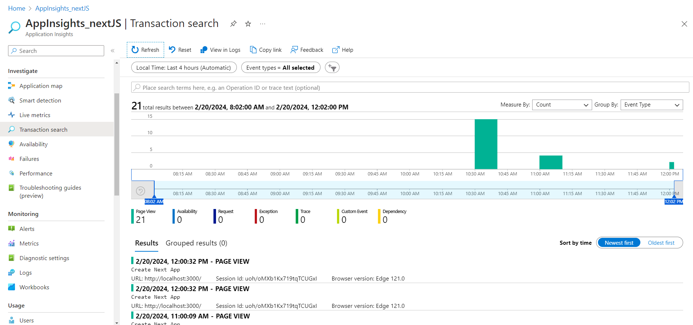
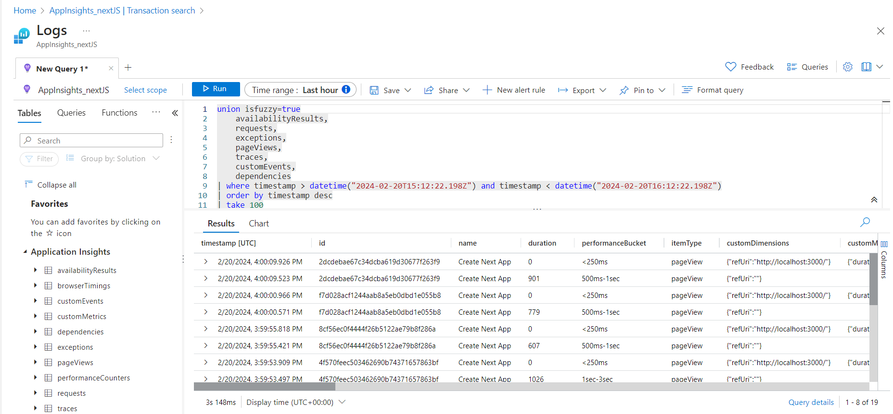
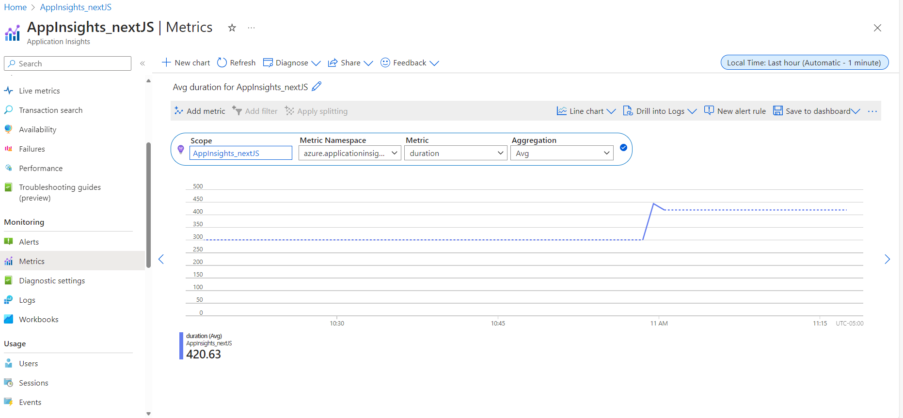

## Sample App
- This is  web application that sends custom metrics for client side monitoring to Azure App Insights using [Client Side Javascript SDK](https://learn.microsoft.com/en-us/azure/azure-monitor/app/javascript-sdk?tabs=javascriptwebsdkloaderscript)
- The app is a [Next.js](https://nextjs.org/) project bootstrapped with [`create-next-app`](https://github.com/vercel/next.js/tree/canary/packages/create-next-app).

## 
- Next.js version 13.5.1
- applicationinsights-react-js version 3.4.1

## Getting Started
- Configure the value of `connectionString` in `instrumentation.next.ts` with your own Application Insights Instrumentation Key. 
- [Connection Strings](https://learn.microsoft.com/en-us/azure/azure-monitor/app/sdk-connection-string?tabs=dotnet5)

```javascript
First, run the development server:

```bash
npm run dev
# or
yarn dev
# or
pnpm dev
```

Open [http://localhost:3000](http://localhost:3000) with your browser to see the result.

You can start editing the page by modifying `app/page.tsx`. The page auto-updates as you edit the file.

In Azure Application Insights Instance see the metrics being sent to the Application Insights resource.

- Number of Page Views
   
   


- Sample Kusto Query to filter out page views
 
  

- Average Duration of Page Views
  
  
  
## Learn More

To learn more about Next.js, take a look at the following resources:

- [Next.js Documentation](https://nextjs.org/docs) - learn about Next.js features and API.
- [Learn Next.js](https://nextjs.org/learn) - an interactive Next.js tutorial.

You can check out [the Next.js GitHub repository](https://github.com/vercel/next.js/).

## Deploy on Vercel

You can also deploy  Next.js app using the [Vercel Platform](https://vercel.com/new?utm_medium=default-template&filter=next.js&utm_source=create-next-app&utm_campaign=create-next-app-readme).

Check out [Next.js deployment documentation](https://nextjs.org/docs/deployment) for more details.
